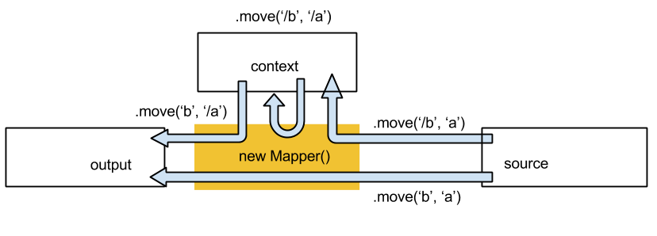

# js-object-mapper

Use this library to declare move, assign and submap instructions which, when executed, transform an input javascript object into an output javascript object.
	
Optional parameters and transform functions make these instructions flexible enough to handle most data mapping requirements.


## Install

``` js
npm install js-object-mapper
```

## Run the Sample

``` js
cd js-object-mapper
node docs/sample.js
```
You should see:

```js
================== mapper ===================
var Mapper = require('../src/mapper');

var mapper = new Mapper('sampleMap')
  .move('Title', 'subject') // move value from property 'subject' to property 'Title'
  .assign('Version', 1) // assign 1 to property 'Version'
  .submap('Names', 'list', {}, new Mapper() // map property 'list' to property 'Names' using submap
    .move('LastName','surname', {}, function(v){return v.toUpperCase();}) // transform using function
  )
  .log('Title')
;

module.exports = mapper;

================== input ===================
{ subject: 'Duty Roster',
  list: [ { surname: 'Smith' }, { surname: 'Jones' } ] }
================== output ===================
{ Title: 'Duty Roster',
  Version: 1,
  Names: [ { LastName: 'SMITH' }, { LastName: 'JONES' } ] }
```

## Test

``` js
npm test

npm run cov // writes code coverage to .coverage

```

## Use

### Define

Construct a named mapper using the Mapper constructor and configure with a cascade of move, assign and submap instructions.

``` js
var Mapper = require('mapper');
var mapper = new Mapper('myMapper')
    .move(..)
    .assign(..)
    .submap(..)
;
```
Detailed description of the instructions can be found in the Instruction  reference below.


### Execute
```js
var context = {config:config, data:data}; // for example
var output = mapper.execute(input, context);
```
When mapper is executed instructions are carried out in the order in which they are defined.

Execution context may be used to pass external variables into and out of the mapper (e.g configuration parameters or reference data). It may also be used to store intermediate results during mapper execution. (e.g a currency code may be defined at the highest level in the input
but embedded within several sub-maps in the output. We can move it from source into the context in the top level map,
and move it from the context to the output in an embedded sub-map.)

Context is indicated by a leading / in the field label of a move instruction, as the following diagram illustrates:



## Instruction Reference

Instructions take up to four parameters:

   1. **to** specifies the property in the output object for the instruction to update. 
     * Can be a property name e.g.`'lastName'`
     * or a dot-separated list of nested property names e.g.`'name.last'` 
     * A `'/'` prefix is used to indicate that the target is a property of the execution context rather than the output. 
     * Mandatory. 
   2. **from** specifies the properties in the input object used by the instruction. 
     * Can be property name  e.g.`'lastName'`
     * or a dot-separated list of nested property names e.g.`'name.last'`
     * or a [JSONPath](https://www.npmjs.org/package/JSONPath) expression e.g.`'$..last'`
     * `' '` indicates the entire input object. 
     * Multiple inputs may be specified in an array e.g.`['last','first']`
     * or an object  e.g.`{last:'last', first:'first'}`
     * A `'/'` prefix is used to indicate that the source is a property of the execution context rather than the input object. 
     * Optional. If not specified then it is assumed to be the same as 'to'. 
   3. **options** - an object with properties (e.g. condition, filter, default) which modify the instruction's behaviour. 
      * Varies by instruction (see below)
      * Optional.
   4. **transform** - function or mapper instance used to transform  ''from' value to 'to' value'.
     * Varies by function (see below)
     * Optional.


### Move

sets target property from values of source properties.
	
*options*

* condition
	* `function(v,i,c){return boolean}` 
    * v is input value, i is index of containing iterated submap, c is execution context 
    * returns true or false to indicate whether on not the move takes place
* multiple 
    * false (default) - set target value
    * true - push value to target array
* default - set target to this value if otherwise unset

*transform*
 
* `function(v,i,c){return output;}`
* v is value of source property (or array or object of values)
* i is index of enclosing iterated submap (or undefined if not iterated)
* c is execution context
* target property set to output (unless transform returns undefined)
	


### Assign
	
Sets target property from static value.

*options*

* condition
    * `function(v,i,c){return boolean}` 
    * v is input value, i is index of containing iterated submap, c is execution context 
    * returns true or false to indicate whether on not the move takes place


*transform*
 
* `function(v,i,c){return output;}`
* v is value of source property (or array or object of values)
* i is index of enclosing iterated submap (or undefined if not iterated)
* c is execution context
* target property set to output (unless transform returns undefined)

### Submap

A *submap* is an instance of Mapper which is applied to the value of the source object property to generate a value to push or set to target object property.

If the source object is an array then, by default, sub-map will be applied to each element of the array,  generating an output array.

If the source object is not an array then, by default, sub-map generates an output object.

*options*

* filter
    * `function(v,i,c){return boolean}` 
    * v is value of current element, i is index of current element, c is execution context 
    * returns true to apply  submit to this element, false to skip.
* condition
    * `function(v,i,c){return boolean}` 
    * v is full input value, i is index of containing iterated submap, c is execution context 
    * returns true or false to indicate whether on not the submap is executed
* multiple 
    * false (default) - set target value
    * true - push value to target array
* default - set target to this value if otherwise unset

*transform*
 
* `new Mapper()`

### Log

The log instruction takes the *to* parameter only, and displays debug information about the value of the output or context property specified. For example:

```js
DEBUG=js-object-mapper node sample.js
```
Output will include:

```js
  js-object-mapper ==============start mapping log: sampleMap Title=============== +0ms
  js-object-mapper 'Duty Roster' +0ms
  js-object-mapper ================end mapping log: Title=============== +0ms
```
This can be particularly useful for examining intermediate results.

## Mapping Tips

### Mapper.get
To safely get nested property values from the input or context use the Mapper.get function. Takes a dot separated string and returns data or undefined.

### Using the execution context
* Complicated mappings can always be implemented in raw javascript, however it is often more readable/maintainable to split the mapping into a number of intermediate stages, storing results in the execution context
* For example some output formats use variable property names (dependant on data).
To handle this with a mapper you can firstly map to an equivalent form with static property names in the context, then use a javascript function (in a move instruction) to convert to the final form.

### Merging
* It is a common requirement to take multiple arrays from the source and merge them together in some way. Sometimes the arrays match one for one and can be merged element by element, in other cases data from one array is looked up to enhance the elements of another. Arrays with a similar structure can also be merged by concatenation.
* No specific instructions are included in js-object-mapper for merging arrays, but most requirements can be met by iterating over a single array with a submap, using the index parameter passed to contained transform functions to fetch data from elsewhere. Concatenation will occur automatically if two different arrays are submapped to the same target. 

### Common Pitfalls
* `move` copies values by reference.This does not usually cause a problem, but beware of making updates to properties in the execution context which are referenced by more than one target.  
* Be careful when using an array in the execution context; this is the main source of hard-to-find mapping bugs. Arrays are not reset automatically so be sure to reset as necessary during submap iterations.  Use `.assign(‘/array’, null)` ( **not** `.assign(‘/array’, [])`)

## Generate Unit Test Skeletons

For good unit test coverage, transform, condition and filter functions should be referenced and tested individually. This can be done with `to` and `paramTo` properties of the map as in the following snippet:

```javascript
var mapper = new Mapper()
	.submap('A', 'a', {}, new Mapper()
		.move(	'B', 
				'b', 
				{condition: function(v,i,c){ return v > 0;}}, 
				function(v,i,c){return Math.sqrt(v);}
		) 		
	)
;

var transform = mapper.to.A.to.B;
var condition = mapper.to.A.paramTo.B.condition;
```
If a mapper instance is exported from a node module ( using `module.exports = new Mapper()....`) the tools/unitTestGenerator can be used to generate a mocha test skeleton for unit testing the map. For example:

```javascript
node tools/unitTestGenerator.js ./docs/sampleMap.js
```
will write a sample unit map test skeleton for sampleMap to stdout:

```javascript
/* global describe, it, before, after */
/* jslint node: true */
'use strict';
var should = require('should');

var sampleMap = require('./docs/sampleMap.js');

var context = {}; // TODO

describe('sampleMap', function(){

  describe('Title', function(){

    it('should .....', function(){  // TODO
      var input = {}; // TODO
      var output = {}; // TODO
      sampleMap.to.Title(input, 0, context).should.eql(output);
    });

  });

  describe('Version', function(){

    it('should .....', function(){  // TODO
      var input = {}; // TODO
      var output = {}; // TODO
      sampleMap.to.Version(input, 0, context).should.eql(output);
    });

  });

  describe('Names', function(){

    describe('LastName', function(){

      it('should .....', function(){  // TODO
        var input = {}; // TODO
        var output = {}; // TODO
        sampleMap.to.Names.to.LastName(input, 0, context).should.eql(output);
      });

    });

  });
});
```

## Generate Map Tests

Unit tests are good for test coverage of embedded javascript functions but don't test map output for given input.  To create a map test execute the map with the environment variable `MAPPER_TEST_GEN` set to `true`.

```js
MAPPER_TEST_GEN=true node docs/sample.js
```
executes the sampleMap mapper, causing  sampleMap.spec.js  to be written to the test directory:

``` js
/* global describe, it, before, after */
/* jslint node: true */
'use strict';

var should = require('should');
var sampleMap = require('../docs/sampleMap.js');

var context = {} ;


describe("Test for mapper sampleMap", function () {

  var input = { subject: 'Duty Roster',
    list: [ { surname: 'Smith' }, { surname: 'Jones' } ] };

  it("Test for mapper sampleMap", function () {
    var output = sampleMap.execute(input, Object.create(context));

    output.should.eql({ Title: 'Duty Roster',
      Version: 1,
      Names: [ { LastName: 'SMITH' }, { LastName: 'JONES' } ] });
  });

});
```

To run this test:

```js
npm test
```


